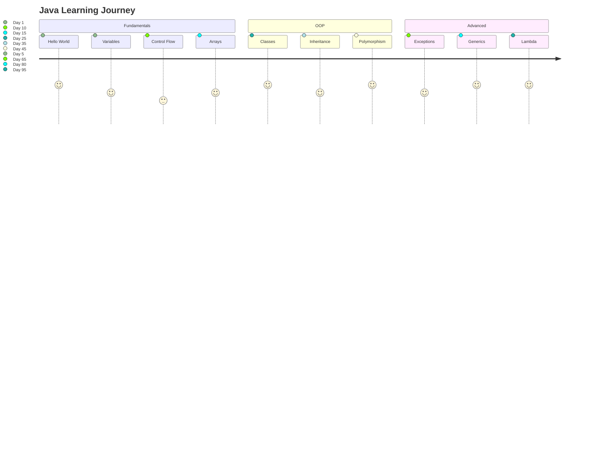

<div align="center">

<!-- Hero Banner -->


# ☕ From Noob to Ninja
### *A Complete Learning Journey Through 100+ Java Programs*

<!-- Status Badges -->


<!-- Social Badges -->
[](https://github.com/Piyush64-bit/Java-Programs/stargazers)
[](https://github.com/Piyush64-bit/Java-Programs/network)
[](https://opensource.org/licenses/MIT)

<br>

<!-- Mission Statement -->
<blockquote>
<h3>🎯 Mission Accomplished!</h3>
<p>This repository chronicles my 100-day journey mastering Java programming from absolute basics to advanced concepts. Every line of code represents dedication, growth, and the pursuit of becoming a skilled Software Development Engineer.</p>
</blockquote>

</div>

---

<!-- Table of Contents with better formatting -->
<details>
<summary>📋 <strong>Table of Contents</strong></summary>
<br>

- [🧠 What's Inside](#-whats-inside)
- [📚 Topics Covered](#-topics-covered)
- [🗂️ Repository Structure](#️-repository-structure)
- [🛠️ Tech Stack](#️-tech-stack)
- [⚙️ Quick Start Guide](#️-quick-start-guide)
- [🌟 Learning Journey](#-learning-journey)
- [🎯 Key Achievements](#-key-achievements)
- [🚀 Next Steps](#-next-steps)
- [🤝 For Learners](#-for-learners)
- [📬 Connect](#-connect)
- [📄 License](#-license)

</details>

---

## 🧠 What's Inside

<div align="center">

### 📁 **100+ Java Programs** organized into comprehensive modules

</div>

<table>
<tr>
<td width="33%">

#### 🟢 **Core Fundamentals**
- 📝 Variables & Data Types
- 🔄 Control Structures
- 🧩 Method Mastery
- 🗃️ Arrays & Collections

</td>
<td width="33%">

#### 🟡 **Object-Oriented**
- 🏗️ Classes & Objects
- 🧬 Inheritance & Polymorphism
- 🛡️ Encapsulation
- 🧱 Abstraction

</td>
<td width="33%">

#### 🔴 **Advanced Concepts**
- ⚠️ Exception Handling
- 📦 Package Management
- 🔗 Lambda Expressions
- 🧬 Generics

</td>
</tr>
</table>

<br>

<div align="center">

### 🎮 **Featured Projects**

| Project | Description | Concepts |
|---------|-------------|----------|
| 🎲 **Quiz Game** | Interactive console application | Control Flow, Collections |
| 📊 **Grade Manager** | Student management system | OOP, File I/O |
| 🧮 **Calculator** | Mathematical operations | Methods, Exception Handling |
| 🏦 **Bank Simulator** | Real-world application | Advanced OOP, Design Patterns |

</div>

---

## 📚 Topics Covered

<details>
<summary>🔥 <strong>Click to explore all 50+ concepts mastered</strong></summary>
<br>

<div align="center">

### 🌱 **Learning Progression**

</div>



<table>
<tr>
<td>

### 🟢 **Fundamentals (Days 1-20)**
- ✅ Variables & Data Types (Primitive & Reference)
- ✅ Operators (Arithmetic, Logical, Bitwise)
- ✅ Input/Output Operations
- ✅ Control Flow (if-else, switch, loops)
- ✅ Methods & Parameter passing
- ✅ Arrays (1D, 2D, Jagged)

</td>
<td>

### 🟡 **Intermediate (Days 21-60)**
- ✅ Object-Oriented Programming Fundamentals
- ✅ Classes & Objects
- ✅ Constructors & Method Overloading
- ✅ Inheritance & super keyword
- ✅ Polymorphism (Runtime & Compile-time)
- ✅ Abstract Classes & Interfaces

</td>
</tr>
<tr>
<td>

### 🟠 **Advanced OOP (Days 41-70)**
- ✅ Packages & Access Modifiers
- ✅ String Manipulation & StringBuilder
- ✅ Exception Handling & Custom Exceptions
- ✅ File I/O Operations
- ✅ Collections Framework Overview

</td>
<td>

### 🔴 **Expert Level (Days 71-100)**
- ✅ Generics & Type Safety
- ✅ Collections Framework (List, Set, Map)
- ✅ Lambda Expressions & Functional Interfaces
- ✅ Stream API & Method References
- ✅ Multithreading Basics
- ✅ Design Patterns (Singleton, Factory)

</td>
</tr>
</table>

</details>

---

## 🗂️ Repository Structure

<details>
<summary>🔍 <strong>Click to explore the complete folder structure</strong></summary>
<br>

```
📦 Java-Programs
├── 📁 01_Basic/                     ← 🌟 Start Here!
│   └── 🧪 Practice-Set/
├── 📁 02_DataTypes/                 ← 🎯 Primitives & Objects
├── 📁 03_Variables/                 ← 🔄 Scope & Lifecycle
├── 📁 04_OperatorsAndExpressions/   ← ➕ Mathematical Operations
│   └── 🧠 PracticeProblem/
├── 📁 05_ControlStatement/          ← 🎮 Logic & Flow Control
│   └── 🎲 QuizGame/                 ← Mini Project!
├── 📁 06_Methods/                   ← 🔧 Reusable Code
│   └── 📊 Practice_Project/         ← Grade Manager
├── 📁 07_ArrayAndString/            ← 📝 Data Structures
├── 📁 08_OOPs/                      ← 🏗️ Object-Oriented Basics
│   ├── 🧱 Abstraction/
│   ├── 🛡️ Encapsulation/
│   └── 🚗 Inheritance/
├── 📁 09_ArrayAndString/            ← 📋 Advanced Collections
│   └── 📋 ArrayList/
├── 📁 10_String/                    ← 🧵 Text Processing
├── 📁 11_OOPs/                      ← 🧬 Advanced OOP
│   ├── 👨‍👩‍👧 inheritance/
│   ├── 🧠 OOPs1/
│   ├── 🧬 OOPs2/
│   └── 🧪 OOPs3/
├── 📁 Exception_Handling/           ← ⚠️ Error Management
├── 📁 LambdaExpression/             ← 🔗 Functional Programming
├── 📁 OOPs/Generics/                ← 🧬 Type Safety
└── 📁 SelfQuestions/                ← 🧠 Challenge Yourself!
    └── 🧪 01_BasicQuestions/
```

</details>

---

## 🛠️ Tech Stack

<div align="center">

### 💻 **Development Environment**

<table>
<tr>
<td align="center" width="25%">
<br>
<strong>Java 24</strong><br>
<sub>OpenJDK</sub>
</td>
<td align="center" width="25%">
<br>
<strong>VS Code</strong><br>
<sub>Java Extension Pack</sub>
</td>
<td align="center" width="25%">
<br>
<strong>Git</strong><br>
<sub>Version Control</sub>
</td>
<td align="center" width="25%">
<br>
<strong>Windows 11</strong><br>
<sub>Development Platform</sub>
</td>
</tr>
</table>


</div>

---

## ⚙️ Quick Start Guide

<div align="center">

### 🚀 **Get Started in 3 Steps**

</div>

<table>
<tr>
<td width="33%" align="center">

### 1️⃣ **Clone**
```bash
git clone https://github.com/Piyush64-bit/Java-Programs.git
cd Java-Programs
```

</td>
<td width="33%" align="center">

### 2️⃣ **Compile**
```bash
cd 01_Basic
javac HelloWorld.java
```

</td>
<td width="33%" align="center">

### 3️⃣ **Run**
```bash
java HelloWorld
```

</td>
</tr>
</table>

<details>
<summary>💡 <strong>Pro Tips & Advanced Commands</strong></summary>
<br>

### 🎯 **Different Scenarios**

**Single File Programs:**
```bash
javac FileName.java && java FileName
```

**Package-based Programs:**
```bash
# Compile from root directory
javac -d . package/path/ClassName.java

# Run with full package name
java package.path.ClassName
```

**Multiple Classes:**
```bash
# Compile all files in directory
javac *.java

# Run the main class
java MainClassName
```

### 🔧 **Useful Shortcuts**

```bash
# Quick compilation for current directory
find . -name "*.java" -exec javac {} +

# Run with custom classpath
java -cp . com.example.MainClass

# Debug mode
java -Xdebug -Xrunjdwp:transport=dt_socket,server=y,suspend=n,address=5005 MainClass
```

</details>

---

## 🌟 Learning Journey

<div align="center">

### 🎯 **My Transformation Timeline**

</div>

<table>
<tr>
<td align="center" width="25%">
<h3>🤔 Day 1</h3>
<strong>"What's a variable?"</strong>
<br><br>
<sub>Starting from scratch</sub>
</td>
<td align="center" width="25%">
<h3>💡 Day 50</h3>
<strong>"I understand OOP!"</strong>
<br><br>
<sub>Concepts clicking</sub>
</td>
<td align="center" width="25%">
<h3>🚀 Day 80</h3>
<strong>"Lambda expressions!"</strong>
<br><br>
<sub>Advanced features</sub>
</td>
<td align="center" width="25%">
<h3>🏆 Day 100</h3>
<strong>"I'm a Java developer!"</strong>
<br><br>
<sub>Mission accomplished</sub>
</td>
</tr>
</table>

<br>

<blockquote>
<h3>💪 What This Journey Taught Me:</h3>
</blockquote>

<table>
<tr>
<td width="50%">

**🧠 Technical Skills:**
- Problem-solving mindset
- Clean code practices  
- Debugging expertise
- Design pattern recognition

</td>
<td width="50%">

**🎯 Soft Skills:**
- Persistence and consistency
- Self-directed learning
- Documentation importance
- Community engagement

</td>
</tr>
</table>

### 🏆 **Key Milestones Achieved**

<div align="center">

| 🎯 Milestone | 📅 Day | 💭 Reflection |
|--------------|--------|---------------|
| ✅ First "Hello World" | Day 1 | The beginning of everything |
| ✅ First working loop | Day 8 | Understanding iteration |
| ✅ First custom class | Day 25 | OOP breakthrough moment |
| ✅ First inheritance | Day 35 | Code reusability unlocked |
| ✅ Exception handling | Day 55 | Writing robust code |
| ✅ Lambda expressions | Day 85 | Modern Java mastery |
| ✅ **100th program** | Day 100 | **Mission Accomplished!** |

</div>

---

## 🎯 Key Achievements

<div align="center">

### 📊 **By the Numbers**

<table>
<tr>
<td align="center" width="20%">
<h2>100+</h2>
<strong>Programs</strong><br>
<sub>Written & Tested</sub>
</td>
<td align="center" width="20%">
<h2>50+</h2>
<strong>Concepts</strong><br>
<sub>Mastered</sub>
</td>
<td align="center" width="20%">
<h2>100</h2>
<strong>Days</strong><br>
<sub>Dedicated Learning</sub>
</td>
<td align="center" width="20%">
<h2>5000+</h2>
<strong>Lines</strong><br>
<sub>Of Code</sub>
</td>
<td align="center" width="20%">
<h2>15+</h2>
<strong>Projects</strong><br>
<sub>Completed</sub>
</td>
</tr>
</table>

</div>

<br>

<details>
<summary>🌟 <strong>Standout Programs & Projects</strong></summary>
<br>

<table>
<tr>
<td width="50%">

### 🎮 **Interactive Quiz Game**
- **Features:** Multiple choice questions, scoring system, difficulty levels
- **Concepts:** Control flow, collections, user input validation
- **Lines:** 200+ lines of well-structured code

### 📊 **Student Grade Manager**  
- **Features:** CRUD operations, file persistence, grade calculations
- **Concepts:** OOP design, file I/O, exception handling
- **Lines:** 300+ lines with comprehensive error handling

</td>
<td width="50%">

### 🧮 **Advanced Calculator**
- **Features:** Scientific operations, expression parsing, history
- **Concepts:** Method overloading, static methods, string manipulation
- **Lines:** 250+ lines with modular design

### 🏦 **Bank Account Simulator**
- **Features:** Multiple account types, transactions, interest calculation
- **Concepts:** Inheritance, polymorphism, encapsulation
- **Lines:** 400+ lines demonstrating real-world OOP

</td>
</tr>
</table>

</details>

---

## 🚀 Next Steps

<div align="center">

### 🎯 **Ready for the Next Challenge?**


</div>

<table>
<tr>
<td width="60%">

### 🌟 **Advanced Java Journey Continues!**

Having mastered the fundamentals, it's time to dive into enterprise-level Java development! The journey doesn't stop here—it evolves.

**What's Next:**
- 🌐 **Web Development** with Spring Framework
- 🗄️ **Database Integration** with Hibernate & JPA
- 🔗 **RESTful APIs** and Microservices
- 🧪 **Testing** with JUnit & Mockito
- 🏗️ **Enterprise Patterns** and Architecture
- ☁️ **Cloud Deployment** and DevOps

</td>
<td width="40%" align="center">

### 📚 **Continue Learning**

<br>

[](https://github.com/Piyush64-bit/AdvanceJava-Programs)

<br><br>

**🚀 Explore Advanced Concepts:**
- Spring Boot Applications
- RESTful Web Services  
- Database Operations
- Security Implementation
- Testing Frameworks

<br>

[**🔗 Start Advanced Java Journey →**](https://github.com/Piyush64-bit/AdvanceJava-Programs)

</td>
</tr>
</table>

<div align="center">

### 🎮 **Learning Path Progression**

```
📚 Core Java (✅ COMPLETED)
       ↓
🌐 Advanced Java (🚀 IN PROGRESS)
       ↓
☁️ Full Stack Development (🔜 COMING SOON)
```

</div>

---

## 🤝 For Learners

<div align="center">

### 🎓 **This Repository is Perfect For:**

</div>

<table>
<tr>
<td align="center" width="25%">
<h3>📚 Beginners</h3>
Starting their Java journey from scratch
<br><br>
<sub>Zero to Hero path</sub>
</td>
<td align="center" width="25%">
<h3>🔄 Intermediate</h3>
Reviewing and strengthening core concepts
<br><br>
<sub>Skill reinforcement</sub>
</td>
<td align="center" width="25%">
<h3>🎯 Students</h3>
Preparing for interviews or exams
<br><br>
<sub>Academic excellence</sub>
</td>
<td align="center" width="25%">
<h3>👨‍💻 Self-learners</h3>
Who prefer learning by example
<br><br>
<sub>Hands-on approach</sub>
</td>
</tr>
</table>

<br>

<blockquote>
<h3>🌟 How to Use This Repository:</h3>
</blockquote>

<table>
<tr>
<td width="50%">

### 📖 **Learning Path**
1. **Start with Basics** - Follow numbered folders sequentially
2. **Practice Along** - Don't just read, code along!
3. **Modify & Experiment** - Change code and observe results
4. **Challenge Yourself** - Solve problems before looking at solutions

</td>
<td width="50%">

### 🚀 **Contribution Guidelines**
- 🐛 **Found a bug?** Open an issue with details
- 💡 **Have a better solution?** Submit a pull request
- 📝 **Want to add documentation?** We'd love that!
- ⭐ **Found it helpful?** Give it a star!

</td>
</tr>
</table>

---

## 📬 Connect

<div align="center">

### 🤝 **Let's Connect & Build Together!**

<br>

<table>
<tr>
<td align="center" width="25%">
<a href="https://github.com/Piyush64-bit">

<br><strong>GitHub</strong>
<br><sub>Follow my journey</sub>
</a>
</td>
<td align="center" width="25%">
<a href="https://www.linkedin.com/in/piyush64bit">

<br><strong>LinkedIn</strong>
<br><sub>Professional network</sub>
</a>
</td>
<td align="center" width="25%">
<a href="mailto:piiyush.sonii@outlook.com">

<br><strong>


